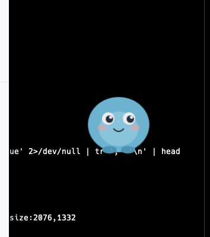
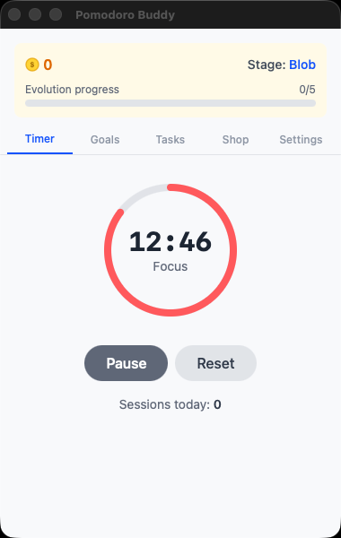

# Desktop Pet - Pomodoro Buddy

A cute desktop companion that lives on your screen, keeps you focused with Pomodoro timers, and evolves the more you work.

<p align="center">
  
  &nbsp;&nbsp;&nbsp;&nbsp;
  
</p>

## What is this?

A tiny blue blob sits on your desktop. Start a focus timer and it gets to work alongside you. Finish sessions to earn coins, buy it accessories, and watch it evolve from a small blob into an armored creature with wings.

## Features

- **Pomodoro Timer** - Three modes (15/5, 25/5, 50/10) with automatic work/break cycling
- **Pet Evolution** - Your pet grows through 3 stages as you complete focus sessions
- **Coin Shop** - Earn coins and buy accessories: party hats, sunglasses, scarves, and snacks
- **Daily Goals** - Track pomodoros, breaks, and tasks completed each day
- **Task List** - Simple checklist to stay on top of what matters
- **Transparent Overlay** - The pet floats on your screen above other windows
- **System Tray** - Quick access to start timers or toggle windows

## Tech Stack

Built with [Tauri 2](https://tauri.app/), React, TypeScript, and TailwindCSS. The pet is pure SVG — no image assets. All data stored locally via Tauri Store plugin.

## Run It

```bash
npm install
npm run tauri dev
```

## Build

```bash
npm run tauri build
```

Outputs a native macOS `.app` bundle.
